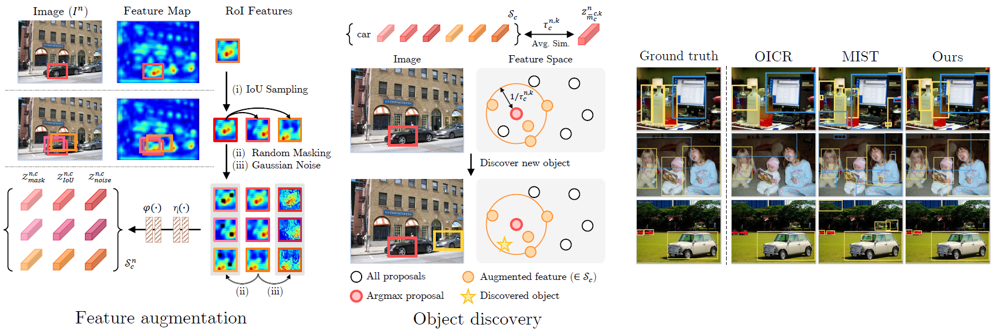

<div align="center">
  <h1> Object Discovery via Contrastive Learning for Weakly Supervised Object Detection</h1>
</div><div align="center">
  <h3>Jinhwan Seo, Wonho Bae, Danica J. Sutherland, Junhyug Noh, and Daijin Kim</h3>
</div>
</div><div align="center">
  <h3><a href="https://github.com/jinhseo/OD-WSCL">[Paper]</a>, <a href="https://jinhseo.github.io/research/wsod.html">[Project page]</a></h3>
</div>
<br /><div align="center">
  
</div>

The official implementation of ECCV2022 paper: "Object Discovery via Contrastive Learning for Weakly Supervised Object Detection"  

[](https://paperswithcode.com/sota/weakly-supervised-object-detection-on-ms-coco?p=object-discovery-via-contrastive-learning-for)  
[](https://paperswithcode.com/sota/weakly-supervised-object-detection-on-ms-coco-1?p=object-discovery-via-contrastive-learning-for)  
[](https://paperswithcode.com/sota/weakly-supervised-object-detection-on-pascal?p=object-discovery-via-contrastive-learning-for)  
[](https://paperswithcode.com/sota/weakly-supervised-object-detection-on-pascal-1?p=object-discovery-via-contrastive-learning-for)
## Environment setup:

* [Python 3.7](https://pytorch.org)
* [CUDA 11.0](https://developer.nvidia.com/cuda-toolkit)
* [PyTorch 1.7.1](https://pytorch.org)
```bash
git clone https://github.com/jinhseo/OD-WSCL/
cd OD-WSCL

conda create --name OD-WSCL python=3.7
conda activate OD-WSCL

pip install ninja yacs cython matplotlib tqdm opencv-python tensorboardX pycocotools
conda install pytorch==1.7.1 torchvision==0.8.2 cudatoolkit=11.0 -c pytorch

git clone --branch 22.04-dev https://github.com/NVIDIA/apex.git
cd apex
pip install -v --no-cache-dir --global-option="--cpp_ext" --global-option="--cuda_ext" ./
cd ../
python setup.py build develop
```
## Dataset:
* [PASCAL VOC (2007, 2012)](http://host.robots.ox.ac.uk/pascal/VOC/)
* [MS-COCO (2014, 2017)](https://cocodataset.org/#download)  
```bash
mkdir -p datasets/{coco/voc}
    datasets/
    ├── voc/
    │   ├── VOC2007
    │   │   ├── Annotations/
    │   │   ├── JPEGImages/
    │   │   ├── ...
    │   ├── VOC2012/
    │   │   ├── ...
    ├── coco/
    │   ├── annotations/
    │   ├── train2014/
    │   ├── val2014/
    │   ├── train2017/
    │   ├── ...
    ├── ...
```
## Proposal:
Download .pkl file from [Dropbox](https://www.dropbox.com/sh/sprm4dxg7l22jrg/AAD0kBctuRnCg_rlZHzEBemQa?dl=0)
```bash
mkdir proposal
    proposal/
    ├── SS/
    │   ├── voc
    │   │   ├── SS-voc07_trainval.pkl/
    │   │   ├── SS-voc07_test.pkl/
    │   │   ├── ...
    ├── MCG/
    │   ├── voc
    │   │   ├── ...
    │   ├── coco
    │   │   ├── MCG-coco_2014_train_boxes.pkl/
    │   │   ├── ...
    ├── ...
```
## Train:
```bash
python -m torch.distributed.launch --nproc_per_node={NO_GPU} tools/train_net.py  
                                   --config-file "configs/{config_file}.yaml"
                                   OUTPUT_DIR {output_dir}
                                   nms {nms threshold}
                                   lmda {lambda value}
                                   iou {iou threshold}
                                   temp {temperature}
```
Example:
```bash
python -m torch.distributed.launch --nproc_per_node=1 tools/train_net.py 
                                   --config-file "configs/voc07_contra_db_b8_lr0.01_mcg.yaml" 
                                   OUTPUT_DIR OD-WSCL/output 
                                   nms 0.1 
                                   lmda 0.03 
                                   iou 0.5
                                   temp 0.2
```
Note: We trained our model on a single large-memory GPU (<em>e.g.</em>, A100 40GB) to maintain large mini-batch size for the best performance.  
The hyperparameter settings may vary with multiple small GPUs, and results will be provided later.
## Eval:
```bash
python -m torch.distributed.launch --nproc_per_node={NO_GPU} tools/test_net.py
                                   --config-file "configs/{config_file}.yaml" 
                                   TEST.IMS_PER_BATCH 8 
                                   OUTPUT_DIR {output_dir} 
                                   MODEL.WEIGHT {model_weight}.pth
```
Example:
```bash
python -m torch.distributed.launch --nproc_per_node=1 tools/test_net.py 
                                   --config-file "configs/voc07_contra_db_b8_lr0.01_mcg.yaml" 
                                   TEST.IMS_PER_BATCH 8 
                                   OUTPUT_DIR OD-WSCL/output 
                                   MODEL.WEIGHT OD-WSCL/output/model_final.pth
```
## Citation:
If you find helpful our work in your research, please consider cite this: 
```BibTex
@inproceedings{seo2022od-wscl,
 author    = {Seo, Jinhwan and Bae, Wonho and Sutherland, Danica J. and Noh, Junhyug and Kim, Daijin},
 title = {{Object Discovery via Contrastive Learning for Weakly Supervised Object Detection}},
 booktitle = {European Conference on Computer Vision (ECCV)},
 year = {2022}
}
```
We borrowed the main code from <a href="https://github.com/NVlabs/wetectron">wetectron</a>, please consider cite it as well.  
Thank you for sharing your great work!  
```BibTex
@inproceedings{ren-cvpr020,
  title = {Instance-aware, Context-focused, and Memory-efficient Weakly Supervised Object Detection},
  author = {Zhongzheng Ren and Zhiding Yu and Xiaodong Yang and Ming-Yu Liu and Yong Jae Lee and Alexander G. Schwing and Jan Kautz},
  booktitle = {IEEE/CVF Conference on Computer Vision and Pattern Recognition (CVPR)},
  year = {2020}
}
```
## Acknowledgement:
This work was supported by Institute of Information & communications Technology Planning & Evaluation(IITP) grant funded by the Korea government(MSIT) (No.2017-0-00897, Development of Object Detection and Recognition for Intelligent Vehicles)
